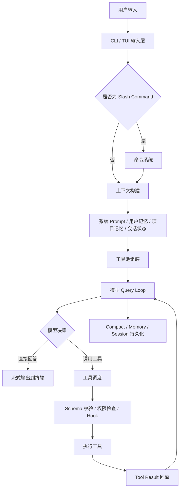

<div align="center">

# Leviathan Code

**终端优先、用户自带模型、本地执行的 Coding Agent Runtime**

[](https://github.com/jett1011586853/Leviathan/actions/workflows/ci.yml)


</div>

## 项目简介

Leviathan Code 是一个运行在本地终端中的 Coding Agent 系统。它不是普通聊天机器人，也不是单纯的命令行包装层，而是一个完整的 Agent Runtime：它能够读取当前工作区、理解用户需求、组装上下文、调用模型、选择工具、执行文件操作、运行命令、管理权限、派发子 Agent、控制浏览器和桌面应用，并在任务过程中持续把真实执行结果回灌给模型。

Leviathan 的核心目标是让用户拥有足够自由度：用户可以接入自己的 Anthropic-compatible 模型网关，配置自己的模型、密钥和上下文策略，不需要绑定特定厂商账号，也不需要通过固定模型列表限制使用方式。

当前版本以 Windows 本地开发环境为优先目标，支持一行命令安装、全局 `leviathan` 启动、会话恢复、五个模型槽位、权限模式切换、Computer Use、Browser DevTools、Skill、MCP、Subagent 和 AgentTeam 等能力。

> 说明：这里的 Anthropic-compatible 仅表示接口协议兼容，不代表本项目属于任何模型厂商或与任何模型厂商存在官方关系。

## 产品设计目标

Leviathan 的产品设计围绕五个原则展开。

### 1. 用户自带模型

模型能力不应该被固定账号体系和固定模型列表锁死。Leviathan 支持用户自行配置：

- 模型网关地址 `baseUrl`
- 模型名称 `modelName`
- 访问密钥 `apiKey` 或 `authToken`
- 推理强度 `effort`
- 本地上下文策略，例如 `[1m]` 上下文标记

用户可以通过 `/model` 保存最多五个模型槽位，并在会话内自由切换。多个槽位可以使用相同模型，也可以连接完全不同的供应商。

### 2. 终端优先

Leviathan 默认在当前目录工作。用户只需要进入项目目录并输入：

```powershell
leviathan
```

该目录就会成为当前工作区。Agent 能够基于工作区中的真实文件、Git 状态、用户指令和历史会话完成开发任务。

### 3. Agent 不是聊天窗口

Leviathan 的核心不是一次问答，而是一个模型驱动的执行循环：

1. 用户提出需求。
2. 系统组装上下文和可见工具。
3. 模型判断下一步动作。
4. 工具执行真实操作。
5. 工具结果回灌给模型。
6. 模型基于新状态继续推理。
7. 直到任务完成、等待用户确认或进入新的计划阶段。

### 4. 高权限能力默认隔离

Computer Use 和 Browser DevTools 可以控制真实应用和浏览器，风险远高于普通代码读取。因此 Leviathan 将这些能力设计为独立功能插件，默认关闭。

用户必须输入：

```text
/computer use
```

并选择开启后，相关工具才会进入 Agent 的工具池。这样可以避免高权限能力和普通开发行为混在一起。

### 5. 本地优先，可持续分发

Leviathan 支持 Windows standalone 可执行文件，一行命令安装，自动写入 PATH，后台检查 GitHub Release，下载后进行 SHA-256 校验，并在下一次启动前应用更新。

这让 Leviathan 不只是一个源码项目，也可以作为面向普通用户分发的本地开发工具。

## 快速开始

### 一行安装

在 PowerShell 中执行：

```powershell
irm https://raw.githubusercontent.com/jett1011586853/Leviathan/main/install.ps1 | iex
```

安装完成后，进入任意项目目录：

```powershell
cd D:\path\to\your-project
leviathan
```

首次使用时，建议输入：

```text
/model
```

然后选择一个空槽位，依次填入：

1. 模型网关地址
2. 模型名称
3. API Key 或 Auth Token

示例：

```text
baseUrl: https://your-gateway.example.com/anthropic
modelName: mimo-v2.5
apiKey: your-provider-token
```

如果模型网关支持 1M 上下文，可以在模型名后加本地标记：

```text
mimo-v2.5[1m]
```

`[1m]` 是 Leviathan 客户端侧上下文标记，真正发送给模型供应商时会被移除，避免污染 provider model id。

## 常用命令

| 命令 | 说明 |
| --- | --- |
| `leviathan` | 在当前目录启动交互式 Agent 会话 |
| `leviathan -c` | 继续当前工作区最近一次会话 |
| `leviathan -r` | 打开历史会话选择器 |
| `leviathan --dangerously-skip-permissions` | 以完全访问模式启动，跳过权限确认 |
| `/model` | 配置或切换五个模型槽位 |
| `/effort` | 切换推理强度，支持 `low`、`medium`、`high`、`max` |
| `/leviathan` | 创建或定位安装级长期指令文件 `leviathan.md` |
| `/computer use` | 打开 Computer Use 功能开关 |
| `/help` | 查看交互式帮助 |

> 警告：`--dangerously-skip-permissions` 会跳过权限确认，可以修改或删除文件，也可以执行任意命令。只应在可信工作区中使用。

## Agent 整体链路

Leviathan 的核心是一个多轮 Agent 执行循环。简化链路如下：



这条链路让 Leviathan 具备持续执行能力。它不是把一次模型输出当成最终答案，而是允许模型根据真实工具结果不断修正判断。

## 核心架构模块

### 1. CLI 与 TUI 交互层

Leviathan 使用 TypeScript、Bun、React 和 Ink 构建终端交互界面。CLI 层负责启动参数、工作区识别、模型配置预加载、权限模式初始化和会话恢复；TUI 层负责输入框、消息流、工具调用展示、权限确认、状态栏和交互式命令。

关键能力：

- 当前目录自动作为工作区。
- 支持 Slash Command。
- 支持流式模型输出。
- 支持工具调用可视化。
- 支持权限确认弹窗。
- 支持 Shift+Tab 切换权限模式。
- 支持会话继续与历史恢复。

### 2. BYOM 模型接入层

BYOM 即 Bring Your Own Model。Leviathan 允许用户接入任意 Anthropic-compatible 模型网关。

模型接入层负责：

- 读取环境变量模型配置。
- 读取 `/model` 保存的五个模型槽位。
- 应用当前激活槽位到运行时环境。
- 支持自定义模型名，不依赖本地 allowlist。
- 支持 `low`、`medium`、`high`、`max` 推理强度。
- 支持 `[1m]` 本地上下文标记解析。
- 清理互斥 provider 环境，避免多个模型供应商配置互相污染。

这让 Leviathan 可以适配不同网关、不同模型和不同上下文策略。

### 3. 上下文构建系统

Agent 的效果不只取决于模型，还取决于每轮请求给模型的上下文是否正确。Leviathan 会动态组装：

- 系统提示词
- 当前工作区信息
- 用户输入
- 当前权限模式
- 当前模型信息
- 可见工具列表
- 静态长期记忆
- 会话历史
- 工具结果
- 计划和任务状态
- MCP 指令
- Skill 发现结果

上下文不是一次性塞满，而是根据当前任务、工具、权限和记忆状态动态构建。

### 4. 记忆体系

Leviathan 的记忆分为三层。

#### 短期记忆

短期记忆存在于当前会话中，包括：

- 当前对话消息
- 工具调用结果
- 当前任务计划
- Todo 状态
- 最近读取过的文件状态

它保证 Agent 在一个任务过程中保持连续性。

#### 静态长期记忆

静态长期记忆来自本地 Markdown 指令文件，加载优先级从低到高包括：

1. 托管级 `LEVIATHAN.md`
2. 安装目录 `leviathan.md`
3. 用户级 `~/.leviathan/LEVIATHAN.md`
4. 项目级 `LEVIATHAN.md`
5. 项目规则 `.leviathan/rules/*.md`
6. 本地私有 `LEVIATHAN.local.md`

这些文件适合保存稳定偏好、代码规范、项目规则和长期使用习惯。

#### 动态会话记忆

动态会话记忆用于长对话。系统会根据 token 增长和工具调用次数判断是否需要提取记忆，不会每轮都写入，避免记忆膨胀和污染。

### 5. Compact 与上下文压缩

长任务会不断积累消息和工具结果，最终接近模型上下文限制。Leviathan 支持：

- Auto Compact
- Microcompact
- Post Compact 恢复
- 工具结果预算控制
- 文件恢复预算控制
- Skill 恢复预算控制
- 图片和文档块压缩前剥离
- 重复 Skill discovery 附件剥离

Compact 的目标不是简单删除历史，而是把历史压缩成可继续工作的摘要，并尽可能保留关键文件、计划、工具结果和用户意图。

### 6. Tool Pool 工具池

Leviathan 的工具不是散落调用，而是通过集中式 Tool Pool 统一组装和治理。

工具来源包括：

- 内置文件工具
- Shell 工具
- 搜索工具
- Todo 和计划工具
- AgentTool
- SkillTool
- MCP 工具
- Browser DevTools
- Computer Use
- AgentTeam 工具

工具池组装时会根据以下因素动态过滤：

- 当前权限上下文
- Deny / Allow 规则
- 功能开关
- MCP 连接状态
- Computer Use 是否开启
- REPL 或特殊运行模式
- 工具是否可用

工具池会保持稳定排序，减少 prompt cache 失效，同时保证内置工具和 MCP 工具重名时优先级明确。

### 7. 工具执行链路

当模型发起 `tool_use` 后，Leviathan 不会直接执行，而是经过完整执行链路：

1. 根据工具名查找工具定义。
2. 使用 Zod schema 校验输入。
3. 判断工具是否存在、是否启用。
4. 执行权限检查。
5. 执行 PreToolUse Hook。
6. 执行真实工具调用。
7. 记录工具状态和耗时。
8. 执行 PostToolUse Hook。
9. 将结果转成 tool_result。
10. 回灌给模型继续推理。

只读且并发安全的工具可以批量并行执行；写文件、执行命令等非只读操作会串行执行，避免状态冲突。

### 8. 权限系统

Leviathan 的权限模型分为工具可见性和工具执行两个阶段。

工具可见性阶段会在模型看到工具前先过滤掉不允许的工具。工具执行阶段会针对具体输入做更细粒度判断，例如：

- 是否允许读取某个路径
- 是否允许编辑某个文件
- 是否允许执行某条命令
- 是否允许使用 Computer Use
- 是否允许使用 Browser DevTools
- 是否需要用户临时确认

常见权限模式：

- Plan：先规划，修改前需要确认。
- Accept Edits：允许接受编辑类操作。
- Full Access：完全访问模式。
- Bypass Permissions：跳过权限确认的高风险模式。

### 9. 文件、Shell 与代码理解能力

Leviathan 通过 repo-native retrieval 理解代码库，优先使用真实项目状态，而不是依赖离线索引。

主要能力：

- 使用 Glob 查找文件。
- 使用 Grep 或 `rg` 搜索关键字。
- 使用 FileRead 读取局部代码。
- 使用 FileEdit 和 FileWrite 修改文件。
- 使用 Bash / PowerShell 执行测试、构建和脚本。
- 可通过 LSP、MCP 或 Skill 扩展符号分析、AST 分析和调用链分析。

这种设计适合真实工程项目，因为它直接面向当前工作区的文件系统和命令行环境。

### 10. Skill 体系

Skill 是可复用的任务流程单元，用来沉淀某类任务的固定方法论。

Skill 可以来自：

- 内置 Skill
- 用户本地 Skill
- 项目 Skill
- Plugin 提供的 Skill
- MCP prompt 转换的 Skill

模型可以通过 SkillTool 调用 Skill。Skill 会在隔离的 forked agent context 中执行，减少对主上下文的污染，并把最终结果返回给主 Agent。

适合沉淀为 Skill 的任务包括：

- 固定代码审查流程
- 特定框架开发规范
- 文档生成流程
- 数据分析流程
- 安全检查流程
- 部署流程

### 11. Plugin 与 MCP 扩展

Leviathan 的扩展体系分为三层：

- Skill：沉淀任务方法。
- MCP：接入外部工具和数据源。
- Plugin：把 Skill、MCP、命令和资源打包成可复用能力。

这样核心 Runtime 不需要频繁改动，就能持续扩展工具边界和领域能力。

### 12. Subagent

AgentTool 可以把独立任务交给子 Agent。子 Agent 拥有自己的 agent id、上下文、模型设置、MCP 连接和工具权限。

适合交给 Subagent 的任务：

- 大范围代码搜索
- 独立方案调研
- 测试失败定位
- 代码审查
- 长时间后台任务
- 在隔离 worktree 中尝试修改

Subagent 的结果会回传给主 Agent，由主 Agent 决定是否采纳、继续追问或整合到最终答案。

### 13. AgentTeam / Swarm

AgentTeam 是多 Agent 协作层。它把主 Agent 设计为 leader，把其他 Agent 设计为 teammate。

核心能力：

- 创建团队
- 注册 leader
- 生成 teammate
- 分配任务
- 维护 team file
- 使用 mailbox 通信
- 使用 SendMessage 发送消息
- 使用 permission bridge 把 teammate 的权限请求转回 leader UI
- 使用 task list 跟踪团队任务
- 使用独立 AbortController 管理 teammate 生命周期

简化结构：

```text
Leader Agent
  ├─ 创建团队
  ├─ 拆分任务
  ├─ 派发 teammate
  ├─ 接收 teammate 消息
  ├─ 审批高风险操作
  └─ 汇总最终结果
```

AgentTeam 适合并行研究、复杂实现、测试验证和多角色协作任务。

### 14. Computer Use

Computer Use 让 Leviathan 可以控制 Windows 桌面应用。

支持动作：

- `list_apps`
- `list_windows`
- `get_window`
- `get_window_state`
- `screenshot`
- `activate_window`
- `click`
- `double_click`
- `right_click`
- `type_text`
- `press_key`
- `scroll`
- `drag`
- `sequence`
- `wait`

技术设计：

- 使用持久化 PowerShell bridge。
- 通过结构化 JSON 消息通信。
- 复用长驻进程，减少每次调用的冷启动延迟。
- 截图作为模型可读取的 image block 返回。
- 默认关闭，通过 `/computer use` 显式开启。

Computer Use 适合控制普通桌面应用、安装器、终端窗口、编辑器界面和无法通过 API 操作的软件。

### 15. Browser DevTools

Browser DevTools 是浏览器专用自动化能力，基于 Chrome DevTools Protocol。

支持能力：

- 启动 Edge / Chrome / Brave
- 连接 DevTools endpoint
- 列出 tab
- 创建 tab
- 页面跳转
- 执行 JavaScript
- 获取 DOM snapshot
- 使用 selector 点击
- 输入文本
- 按键
- 截图
- 关闭 tab

相比纯鼠标点击，Browser DevTools 能直接读取 DOM、执行 JS、使用 selector 操作页面，因此更适合稳定完成浏览器任务。

### 16. 分发与自动更新

Leviathan 支持从源码构建，也支持面向普通用户的一键安装。

发布链路：

1. Git tag 触发 GitHub Actions。
2. 安装 Bun 依赖。
3. 执行测试。
4. 校验 tag 与 package version 一致。
5. 使用 Bun compile 生成 Windows standalone exe。
6. 复制 launcher 和 updater。
7. 生成 SHA-256 校验文件。
8. 发布 GitHub Release。

安装链路：

1. `install.ps1` 拉取最新 Release。
2. 下载 exe、launcher、updater 和 `SHA256SUMS`。
3. 校验 SHA-256。
4. 安装到 `%LOCALAPPDATA%\Leviathan`。
5. 创建 `leviathan.cmd` shim。
6. 写入用户 PATH。

更新链路：

1. launcher 后台检查 Release。
2. updater 下载新版本到 staging 目录。
3. 校验 SHA-256。
4. 写入 pending update。
5. 下次启动前替换 exe。
6. 保留 previous exe 作为恢复点。

## 模型配置

### 使用 `/model`

推荐方式是在 Leviathan 内输入：

```text
/model
```

然后选择槽位并填写模型信息。槽位会保存到本地配置中，后续会话可以直接切换。

### 使用环境变量

也可以通过环境变量启动：

```powershell
$env:ANTHROPIC_BASE_URL="https://your-gateway.example.com/anthropic"
$env:ANTHROPIC_AUTH_TOKEN="your-provider-token"
$env:ANTHROPIC_MODEL="your-provider-model"
leviathan
```

源码开发时可以使用：

```powershell
$env:ANTHROPIC_BASE_URL="https://your-gateway.example.com/anthropic"
$env:ANTHROPIC_AUTH_TOKEN="your-provider-token"
$env:ANTHROPIC_MODEL="your-provider-model"
bun run start
```

不要把真实密钥提交到仓库。

## 隐私与安全

- Leviathan 不要求登录 Leviathan 托管账号。
- 用户配置的模型供应商会收到发送给模型的 prompt、代码上下文和工具结果。
- 使用任何模型网关前，应确认其隐私政策和数据保留规则。
- 不要把 API Key 写入 README、issue、commit、截图或公开日志。
- 使用 Full Access 前应确认当前工作区可以恢复。
- Computer Use 能控制真实应用，默认关闭是有意设计。
- 对敏感仓库使用前，建议先在隔离目录或临时 worktree 中测试。

## 开发环境

源码开发需要：

- Windows 10 或 Windows 11
- PowerShell 5.1 或更高版本
- Git
- Bun
- 可用的 Anthropic-compatible 模型网关

常用开发命令：

```powershell
bun install --frozen-lockfile
bun run test
bun run build
bun run build:startup
bun run build:release
```

## 项目目录

```text
src/
  entrypoints/          CLI 入口
  commands/             Slash Command 和交互命令
  tools/                内置工具、AgentTool、SkillTool、Computer Use、Browser DevTools
  services/             API、compact、memory、MCP、tool execution 等服务
  utils/                权限、模型、文件、会话、swarm、配置等通用能力
  components/           Ink / React TUI 组件
scripts/                安装器、launcher、updater 和发布脚本
docs/                   设计文档和实现说明
.github/workflows/      CI 与 Release 工作流
assets/                 图标和发布资源
```

## 产品路线规划

短期目标：

- 提升 Windows Computer Use 的稳定性和响应速度。
- 完善 Browser DevTools 任务模板。
- 增强模型槽位配置体验。
- 补充常见模型网关兼容性说明。
- 改进 README、安装说明和错误排查文档。

中期目标：

- 构建更系统的 Skill 市场和 Skill 沉淀机制。
- 增强 AgentTeam 的任务分配、状态追踪和结果汇总能力。
- 为大型代码库增加更强的符号级检索、AST 分析和调用链分析。
- 建立可复现的 agent harness 评测集。

长期目标：

- 研究 harness-level learning，让 Agent 在工具选择、任务拆解、错误恢复和上下文治理上持续改进。
- 扩展更多桌面应用控制方式。
- 支持更完整的跨平台分发。
- 构建更开放的本地 Agent 插件生态。

## 贡献说明

欢迎提交 issue 和 pull request，尤其是：

- 模型网关兼容性问题
- Windows 终端交互问题
- Computer Use 失败案例
- Browser DevTools 自动化场景
- 文档改进
- 测试补充
- 插件和 Skill 示例

提交问题时请尽量包含：

1. 操作系统版本
2. Leviathan 版本
3. 启动方式
4. 使用的模型网关类型
5. 可复现步骤
6. 关键错误日志

不要提交真实密钥或私人仓库内容。

## 许可证

当前仓库尚未选择正式开源许可证。源码公开可读，但默认不授予复制、修改、分发或商业使用权。后续会在完成来源、权利和依赖审查后再选择合适的开源许可证。

## 如何拉取到本地

如果你只想使用 Leviathan，推荐使用一行安装：

```powershell
irm https://raw.githubusercontent.com/jett1011586853/Leviathan/main/install.ps1 | iex
```

如果你想拉取源码到本地进行开发：

```powershell
git clone https://github.com/jett1011586853/Leviathan.git
cd Leviathan
bun install --frozen-lockfile
```

运行测试：

```powershell
bun run test
```

从源码启动：

```powershell
$env:ANTHROPIC_BASE_URL="https://your-gateway.example.com/anthropic"
$env:ANTHROPIC_AUTH_TOKEN="your-provider-token"
$env:ANTHROPIC_MODEL="your-provider-model"
bun run start
```

构建 Windows 发布文件：

```powershell
bun run build:release
```

以后同步远程更新：

```powershell
git pull origin main
bun install --frozen-lockfile
```
